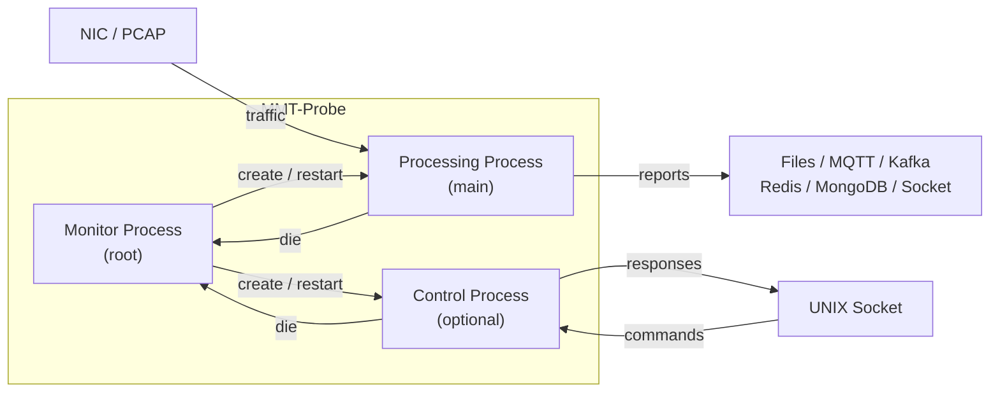
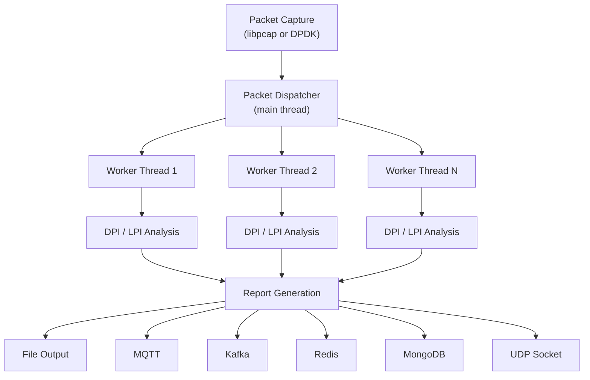
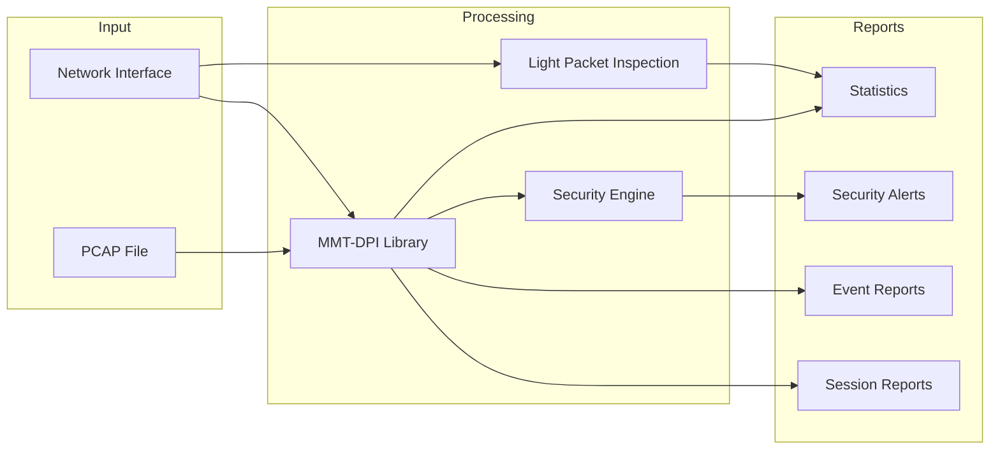

# Architecture

This document describes the internal architecture of MMT-Probe.

## Process Model

MMT-Probe consists of 3 processes:

- **Monitor process** -- The root process. It creates the two children processes and monitors them: it recreates a child if it has crashed.
- **Processing process** -- The main processing. It performs packet capture, DPI/LPI analysis, and report generation.
- **Control process** -- Optional (requires `DYNAMIC_CONFIG_MODULE`). It opens a UNIX domain socket to listen for control commands. After validation, commands are forwarded to the processing process and the monitor process.



```
          +----------------------------------------------------------------------------------+
          |                                   +-------------+                                |
          |                                  /             /|                                |
- NIC     |          +------------+         +-------------+ |        +----------+            |
- pcap    | traffic  |            |  create |             | | create |          |   commands |     +--------+
==========|=========>| processing |<--------| monitoring  |--------->| control  |<===========|=====|        |
          | reports  |   proc.    | die     |    proc.    | |    die |  proc.   | responses  |     |  UNIX  |
<=========|==========|            |-------->|             |<---------|          |============|====>| socket |
- files   |          |            |         |             |/         |          |            |     |        |
- redis   |          +------------+         +-------------+          +----------+            |     +--------+
- mongodb |                                                                                  |
- socket  +----------------------------------------------------------------------------------+
- kafka
```

## Processing Pipeline

Within the processing process, packets flow through a multi-threaded pipeline:



1. **Packet Capture** -- Reads packets from a NIC (libpcap/DPDK) or PCAP file
2. **Dispatcher** -- The main thread dispatches packets to worker threads (when `nb-thread > 0`)
3. **Worker Threads** -- Each worker runs independently with its own MMT-DPI handler
4. **DPI/LPI Analysis** -- Deep or Light packet inspection classifies protocols and extracts attributes
5. **Report Generation** -- Session reports, event reports, and security alerts are generated
6. **Output Channels** -- Reports are written to one or more configured output channels

## Module Architecture

MMT-Probe uses a modular build system. Modules are compiled conditionally based on build flags:

| Module | Build Flag | Description |
|--------|-----------|-------------|
| DPI Reports | (always on) | Deep packet inspection and session/event reporting |
| LPI | (always on) | Light packet inspection for DDoS resilience |
| PCAP Capture | (default) | Packet capture via libpcap |
| DPDK Capture | `DPDK_CAPTURE` | High-performance packet capture via DPDK |
| Security | `SECURITY_MODULE` | Security rule engine (requires MMT-Security) |
| Kafka Output | `KAFKA_MODULE` | Report output to Apache Kafka |
| MQTT Output | `MQTT_MODULE` | Report output to MQTT broker |
| Redis Output | `REDIS_MODULE` | Report output to Redis |
| MongoDB Output | `MONGODB_MODULE` | Report output to MongoDB |
| Socket Output | `SOCKET_MODULE` | Report output to TCP/UDP/UNIX sockets |
| PCAP Dump | `PCAP_DUMP_MODULE` | Dump packets to PCAP files |
| Dynamic Config | `DYNAMIC_CONFIG_MODULE` | Runtime reconfiguration via UNIX socket |
| TCP Reassembly | `TCP_REASSEMBLY_MODULE` | TCP stream reassembly |
| HTTP Reconstruct | `HTTP_RECONSTRUCT_MODULE` | HTTP payload reconstruction |
| FTP Reconstruct | `FTP_RECONSTRUCT_MODULE` | FTP payload reconstruction |
| License | `LICENSE_MODULE` | License key validation |
| NETCONF | `NETCONF_MODULE` | Reconfiguration via NETCONF protocol |
| QoS | `QOS_MODULE` | Response time and transfer time metrics |

## Source Code Layout

```
src/
├── main.c                    # Entry point, process forking, signal handling
├── configure.c/h             # Configuration file parsing (libconfuse)
├── configure_override.c/h    # Runtime -X parameter overrides
├── worker.c/h                # Worker thread lifecycle
├── context.h                 # Global probe context and shared state
├── lib/                      # Utility libraries
│   ├── log.h                 # Logging macros (syslog)
│   ├── malloc.h              # Safe memory allocation wrappers
│   ├── memory.h              # Memory pool management
│   ├── hash.c/h              # Hash functions
│   ├── string_builder.h      # CSV/report string construction
│   ├── system_info.c/h       # CPU and memory statistics
│   ├── version.c/h           # Version information
│   ├── ms_timer.h            # Millisecond timer for periodic flushing
│   └── ...
└── modules/
    ├── dpi/                   # Deep packet inspection
    │   ├── report/            # Session, event, query reports
    │   ├── reconstruct/       # HTTP/FTP payload reconstruction
    │   ├── reassembly/        # TCP reassembly
    │   └── pcap_dump/         # Packet dump to PCAP
    ├── lpi/                   # Light packet inspection
    ├── output/                # Output channel implementations
    │   ├── file/              # File output (CSV)
    │   ├── kafka/             # Kafka producer
    │   ├── mqtt/              # MQTT publisher
    │   ├── redis/             # Redis output
    │   ├── mongodb/           # MongoDB output
    │   └── socket/            # TCP/UDP/UNIX socket output
    ├── security/              # Security rule engine integration
    ├── packet_capture/
    │   ├── pcap/              # libpcap capture
    │   └── dpdk/              # DPDK capture
    ├── dynamic_conf/          # Dynamic reconfiguration
    ├── license/               # License validation
    └── routine/               # Background periodic tasks
```

## Data Flow



## Key Design Decisions

- **Multi-process for resilience** -- The monitor process restarts crashed children automatically, ensuring high availability
- **Multi-threaded workers** -- Packets are dispatched across N worker threads for parallel DPI processing
- **LPI for DDoS resilience** -- Light packet inspection processes packets quickly when DPI would be overwhelmed by attack traffic
- **Modular build** -- Only compile what you need, reducing binary size and dependencies
- **Output abstraction** -- All output channels implement a common interface, allowing reports to be sent to multiple destinations simultaneously
