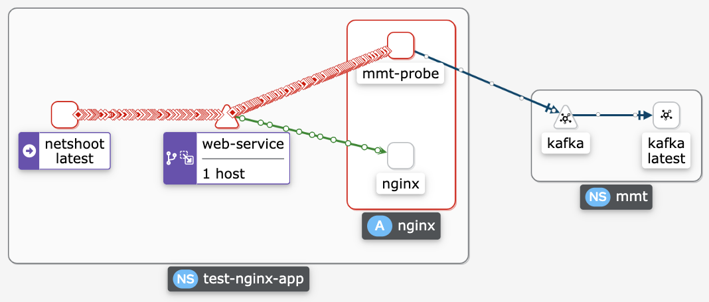

This tutorial shows how to quickly deploy MMT in a Kubernetes cluster.

# Deployment

## Scenario 1: inside the monitored Pod
The following steps will deploy MMT together with Nginx that is an example of the application to be monitored by MMT. To do so, MMT-Probe and nginx are deployed into the same pod so that MMT-Probe can capture all in/outgoing traffic of the pod.


- MMT-Operator can be access from outside the cluster via port 30010.
- Nginx can be access from outside the cluster via port 30011

```bash
#0. create mmt namespace
kubectl create namespace mmt
#1. deploy Kafka and Zookeeper
kubectl apply -f ./kafka.yml -n mmt
#2. deploy MongoDB
kubectl apply -f ./mongo.yml -n mmt
# wait for the MongoDB Pod being available (~20 seconds)
#3. deploy MMT-Operator
kubectl apply -f ./mmt-operator.yml -n mmt
#4. deploy nginx server whose traffic will be monitored by MMT-Probe
kubectl apply -f ./nginx-probe.yml
```

## Scenario 2: outside the monitored Pod

In this scenario, we deploy MMT-Probe and the monitored application, Nginx, in 2 different Pods. We use [Istio](https://istio.io/latest/docs/tasks/traffic-management/mirroring/) to send a copy of live traffic to MMT-Probe. The following picture represents the network topology. We deploy MMT-Probe and Nginx in a new namespace, `test-nginx-app`. MMT-Probe uses Kafka that was deployed in the first Scenario to communicate with MMT-Operator. Thus, you should execute Steps 0-3 in the Scenario 1 if you've not deployed it.



```bash
#0. execute Steps 0 to 3 in the Scenario 1 if you've not done yet
#1. create new namespace with enabled- istio
NAMESPACE="test-nginx-app"
kubectl create namespace $NAMESPACE
kubectl label namespace $NAMESPACE istio-injection=enabled --overwrite
#2. deploy nginx application
kubectl apply -f http-mirroring/nginx.yml -n $NAMESPACE
#3. deploy mmt-probe
kubectl apply -f http-mirroring/mmt-probe.yml -n $NAMESPACE
#4. deploy a simple http client that issue http requests to the Nginx
kubectl apply -f http-mirroring/netshoot.yml -n $NAMESPACE
```

*Limit* A huge limitation of Istio traffic mirroring is only supporting HTTP traffic.


# Test

## Kafka:
Run the following command inside the console of the Kafka pod:

+ list all topics: `/opt/bitnami/kafka/bin/kafka-topics.sh --bootstrap-server=localhost:9092 --describe --topic mmt-reports`

+ subscribe to a topic: `/opt/bitnami/kafka/bin/kafka-console-consumer.sh  --bootstrap-server localhost:9092  --topic mmt-reports  --from-beginning`

+ list all consumers: `/opt/bitnami/kafka/bin/kafka-consumer-groups.sh --list --bootstrap-server localhost:9092`
